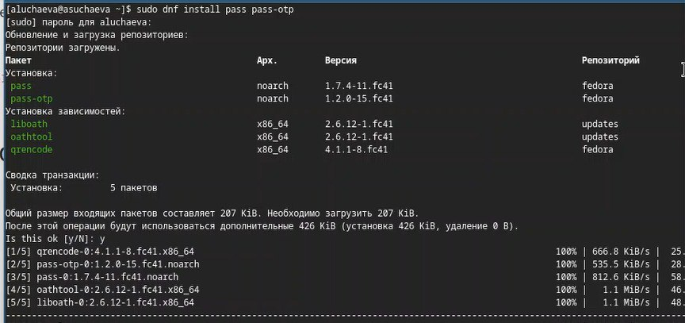
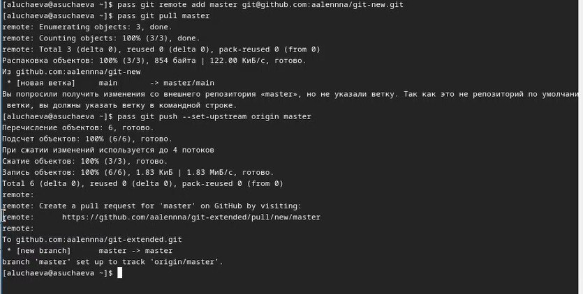
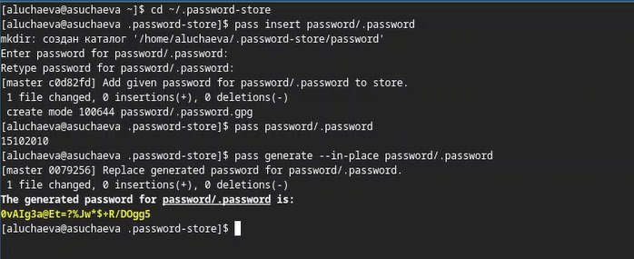
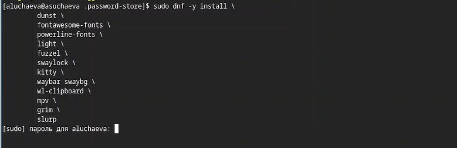
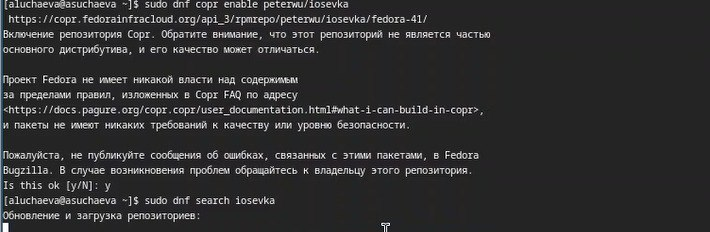
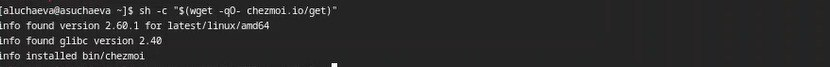
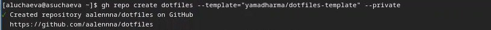
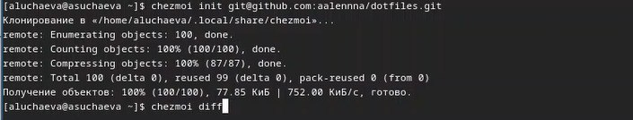

---
## Front matter
lang: ru-RU
title: Лабораторная работа №5
subtitle: Операционные системы
author:
  - Учаева А.С.
institute:
  - Российский университет дружбы народов, Москва, Россия
date: 15 марта 2025

## i18n babel
babel-lang: russian
babel-otherlangs: english

## Formatting pdf
toc: false
toc-title: Содержание
slide_level: 2
aspectratio: 169
section-titles: true
theme: metropolis
header-includes:
 - \metroset{progressbar=frametitle,sectionpage=progressbar,numbering=fraction}
---

# Информация

## Докладчик

:::::::::::::: {.columns align=center}
::: {.column width="70%"}

  * Учаева Алёна Сергеевна
  * Студентка НКА-05-24
  * Российский университет дружбы народов
  * [1132246728@rudn.ru](1132246728@rudn.ru)

:::
::: {.column width="30%"}

:::
::::::::::::::

## Цель работы 

Ознакомиться и научиться работать стакими утилитами, как pass,gopass,nativebmessaging, chezmoi.

## Задание

1. Установить ПО
2. Установить и настроить pass.
3. Настроить интерфейс
4. Сохранить пароль
5. Установить и настроить chezmoi
6. Настроить chezmoi на второй машине
7. Выполнить ежедневные операции с chezmoi

## Теоретическое введение

Менеджер паролей pass — программа, сделанная в рамках идеологии Unix.
Также носит название стандартного менеджера паролей для Unix (The standard Unix password manager).

Основные свойства:

 1. Данные хранятся в файловой системе в виде каталогов и файлов.
 2. Файлы шифруются с помощью GPG-ключа.

Структура базы паролей:

Структура базы может быть произвольной, если Вы собираетесь использовать её напрямую, без промежуточного программного обеспечения. Тогда семантику структуры базы данных Вы держите в своей голове.
Если же необходимо использовать дополнительное программное обеспечение, необходимо семантику заложить в структуру базы паролей.

Рабочие файлы:

Состояние файлов конфигурации сохраняется в каталоге ~/.local/share/chezmoi
Он является клоном вашего репозитория dotfiles.
Файл конфигурации ~/.config/chezmoi/chezmoi.toml (можно использовать также JSON или YAML) специфичен для локальной машины.
Файлы, содержимое которых одинаково на всех ваших машинах, дословно копируются из исходного каталога.
Файлы, которые варьируются от машины к машине, выполняются как шаблоны, обычно с использованием данных из файла конфигурации локальной машины для настройки конечного содержимого, специфичного для локальной машины.
При запуске chezmoi apply вычисляется желаемое содержимое и разрешения для каждого файла, а затем вносит необходимые изменения, чтобы ваши файлы соответствовали этому состоянию.
По умолчанию chezmoi изменяет файлы только в рабочей копии.

## Выполнение лабораторной работы

Устанавливаю pass.

{#fig:001 width=70%}

##

Инициализирую pass.
{#fig:002 width=70%}

##

Делаю первый пароль.

{#fig:003 width=70%}

##

Устанавливаю дополнительное ПО.

{#fig:004 width=70%}

##

Устанавливаю шрифты.

{#fig:005 width=70%}

##

Устанавливаю бинарный файл.

{#fig:006 width=70%}

##

Создаю собственный репозиторий с помощью утилит.

{#fig:007 width=70%}

##

Инициализирую chezmoi.

{#fig:008 width=70%}

## Выводы

В ходе данной лабораторной работы я ознакомилась и научилась работать стакими утилитами, как pass,gopass,nativebmessaging, chezmoi.

