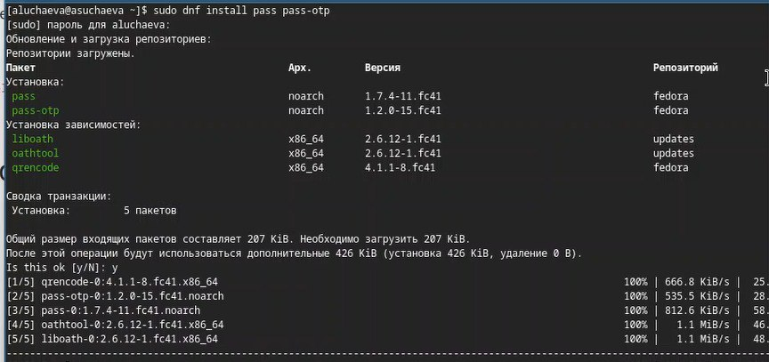
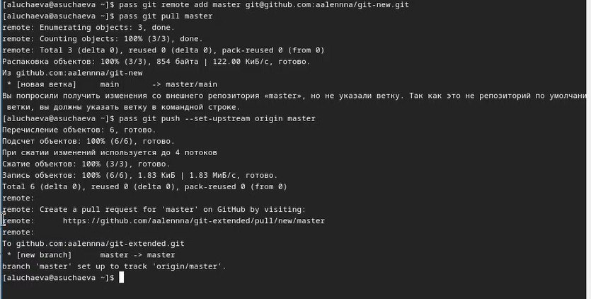
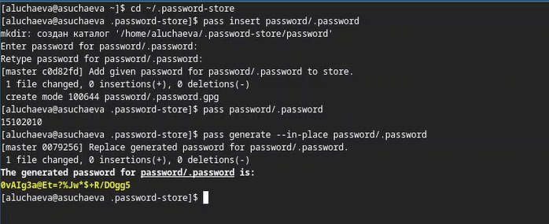
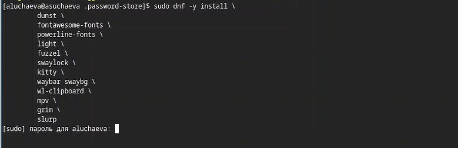
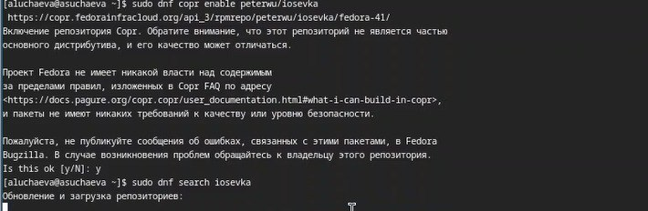
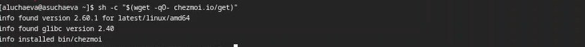
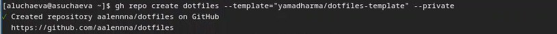
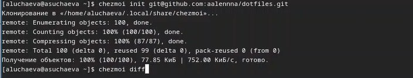

---
## Front matter
title: "Лабораторная работа №5"
subtitle: "Дисциплина: Архитектура компьютера"
author: "Учаева Алёна Сергеевна"

## Generic otions
lang: ru-RU
toc-title: "Содержание"

## Bibliography
bibliography: bib/cite.bib
csl: pandoc/csl/gost-r-7-0-5-2008-numeric.csl

## Pdf output format
toc: true # Table of contents
toc-depth: 2
lof: true # List of figures
lot: true # List of tables
fontsize: 12pt
linestretch: 1.5
papersize: a4
documentclass: scrreprt
## I18n polyglossia
polyglossia-lang:
  name: russian
  options:
	- spelling=modern
	- babelshorthands=true
polyglossia-otherlangs:
  name: english
## I18n babel
babel-lang: russian
babel-otherlangs: english
## Fonts
mainfont: IBM Plex Serif
romanfont: IBM Plex Serif
sansfont: IBM Plex Sans
monofont: IBM Plex Mono
mathfont: STIX Two Math
mainfontoptions: Ligatures=Common,Ligatures=TeX,Scale=0.94
romanfontoptions: Ligatures=Common,Ligatures=TeX,Scale=0.94
sansfontoptions: Ligatures=Common,Ligatures=TeX,Scale=MatchLowercase,Scale=0.94
monofontoptions: Scale=MatchLowercase,Scale=0.94,FakeStretch=0.9
mathfontoptions:
## Biblatex
biblatex: true
biblio-style: "gost-numeric"
biblatexoptions:
  - parentracker=true
  - backend=biber
  - hyperref=auto
  - language=auto
  - autolang=other*
  - citestyle=gost-numeric
## Pandoc-crossref LaTeX customization
figureTitle: "Рис."
tableTitle: "Таблица"
listingTitle: "Листинг"
lofTitle: "Список иллюстраций"
lotTitle: "Список таблиц"
lolTitle: "Листинги"
## Misc options
indent: true
header-includes:
  - \usepackage{indentfirst}
  - \usepackage{float} # keep figures where there are in the text
  - \floatplacement{figure}{H} # keep figures where there are in the text
---

# Цель работы

Ознакомиться и научиться работать стакими утилитами, как pass,gopass,nativebmessaging, chezmoi.

# Задание

1. Установить ПО
2. Установить и настроить pass.
3. Настроить интерфейс
4. Сохранить пароль
5. Установить и настроить chezmoi
6. Настроить chezmoi на второй машине
7. Выполнить ежедневные операции с chezmoi

# Теоретическое введение

Менеджер паролей pass — программа, сделанная в рамках идеологии Unix.
Также носит название стандартного менеджера паролей для Unix (The standard Unix password manager).

Основные свойства:

 1. Данные хранятся в файловой системе в виде каталогов и файлов.
 2. Файлы шифруются с помощью GPG-ключа.

Структура базы паролей:

Структура базы может быть произвольной, если Вы собираетесь использовать её напрямую, без промежуточного программного обеспечения. Тогда семантику структуры базы данных Вы держите в своей голове.
Если же необходимо использовать дополнительное программное обеспечение, необходимо семантику заложить в структуру базы паролей.

Рабочие файлы:

Состояние файлов конфигурации сохраняется в каталоге ~/.local/share/chezmoi
Он является клоном вашего репозитория dotfiles.
Файл конфигурации ~/.config/chezmoi/chezmoi.toml (можно использовать также JSON или YAML) специфичен для локальной машины.
Файлы, содержимое которых одинаково на всех ваших машинах, дословно копируются из исходного каталога.
Файлы, которые варьируются от машины к машине, выполняются как шаблоны, обычно с использованием данных из файла конфигурации локальной машины для настройки конечного содержимого, специфичного для локальной машины.
При запуске chezmoi apply вычисляется желаемое содержимое и разрешения для каждого файла, а затем вносит необходимые изменения, чтобы ваши файлы соответствовали этому состоянию.
По умолчанию chezmoi изменяет файлы только в рабочей копии.

# Выполнение лабораторной работы

Устанавливаю pass(рис. [-@fig:001]).

{#fig:001 width=70%}

Инициализирую pass(рис. [-@fig:002]).

{#fig:002 width=70%}

Делаю первый пароль(рис. [-@fig:003]).

{#fig:003 width=70%}

Устанавливаю дополнительное ПО(рис. [-@fig:004]).

{#fig:004 width=70%}

Устанавливаю шрифты(рис. [-@fig:005]).

{#fig:005 width=70%}

Устанавливаю бинарный файл(рис. [-@fig:006]).

{#fig:006 width=70%}

Создаю собственный репозиторий с помощью утилит(рис. [-@fig:007]).

{#fig:007 width=70%}

Инициализирую chezmoi(рис. [-@fig:008]).

{#fig:008 width=70%}

# Выводы

В ходе данной лабораторной работы я ознакомилась и научилась работать стакими утилитами, как pass,gopass,nativebmessaging, chezmoi.

# Список литературы{.unnumbered}

[Лабораторная №5](https://esystem.rudn.ru/mod/page/view.php?id=1224377)
